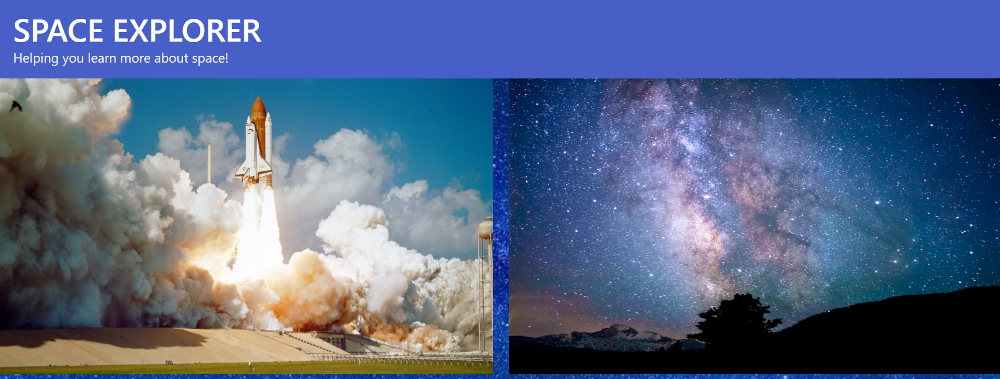

# Welcome to our group project - SPACE EXPLORER!

## This project is created by utilizing HTML, CSS, Bulma, JavaScript, and JQuery with the addition of the Space Devs API and NASA's Astronomy Image of the Day API!

## CALLING ALL SPACE LOVERS!

> ### AS A person who loves space,
>
> ### I WANT to learn more about historical launches, my favorite astronaut, and view NASA’s astronomy image of the day,
>
> ### SO THAT I have a greater appreciation for what NASA has accomplished and what it is still working so hard to provide.

## Once the Space Explorer opens, you will be greeted with two images. One image is a space shuttle launch and the other image is an astronmy image.

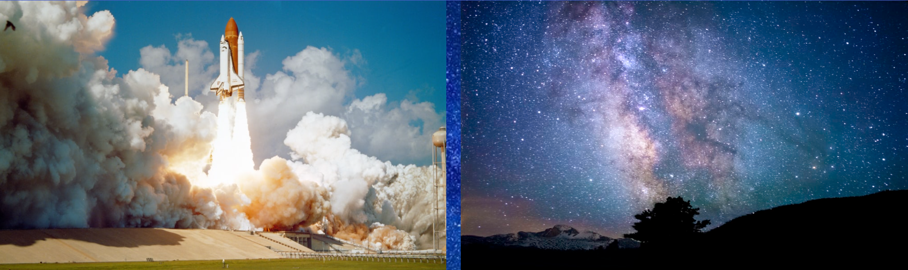

## You will then be given the option to view historical launches.

## When you click View Launches, you will see a display of 10 historical launches with details including the rocket name, date, status, and description.
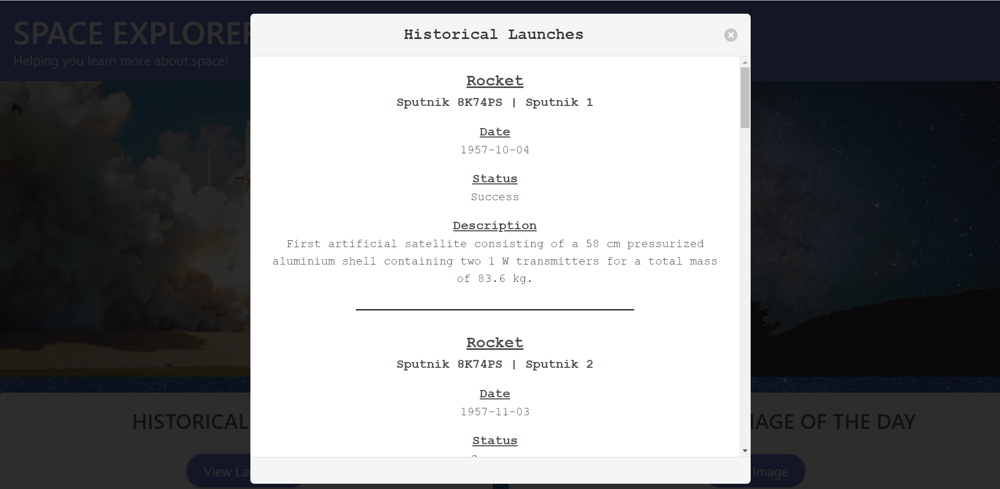

## We also provided the opportunity for you to view NASA's astronomy image of the day.

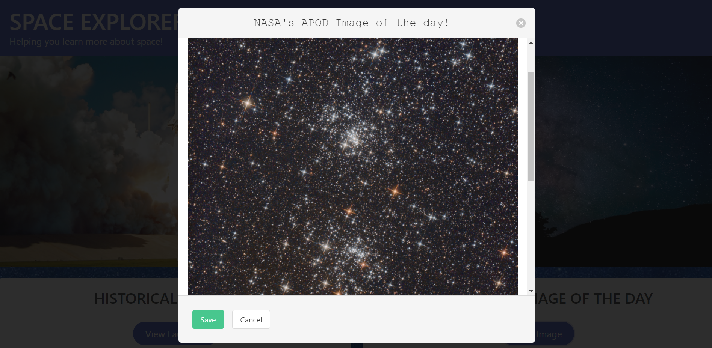

## In addition to the astronomy image, you will also be able to read the description of the image below.

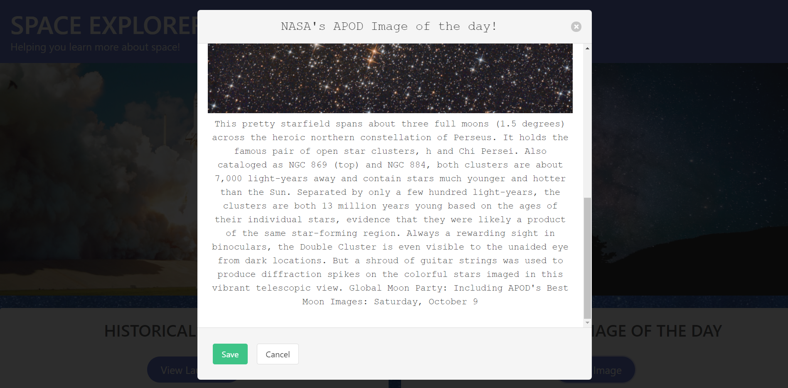

## We know these images are something you most likely want to save, so we provided an area for you to save the images here.

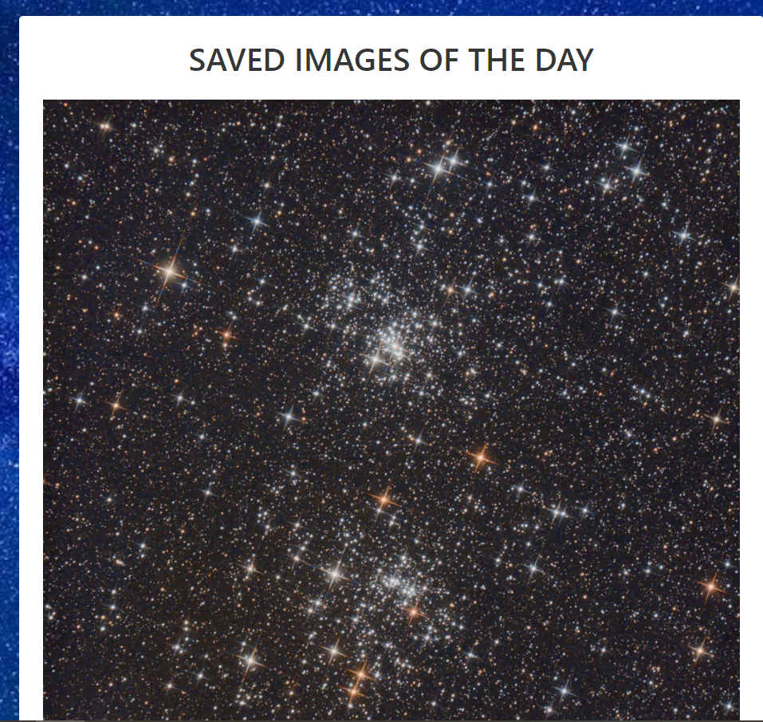

## Local storage was utilized in order to save the image of the day.

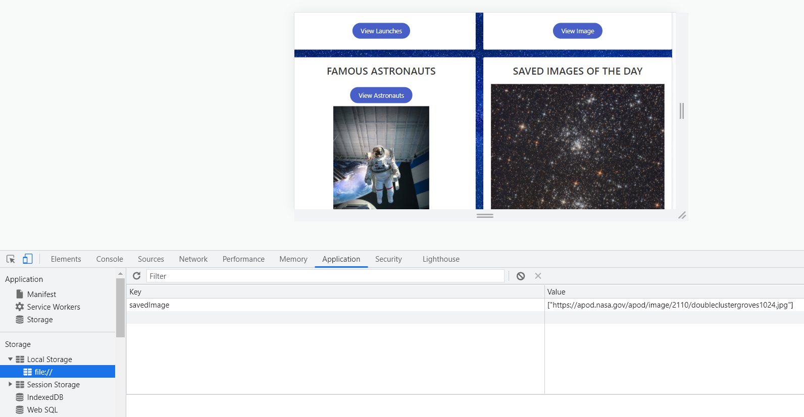

## Want to learn more about famous astronauts? You can also do that here. Click on the View Astronauts button.

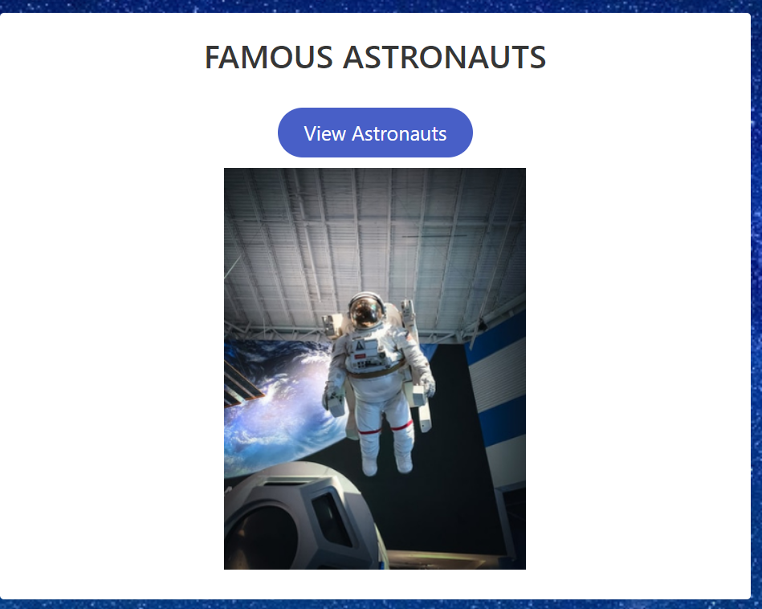

## Once clicked, a modal opens with 10 famous astronauts and their information, including their name, nationality, bio, status, last flight, and a Wikipedia link for more details.

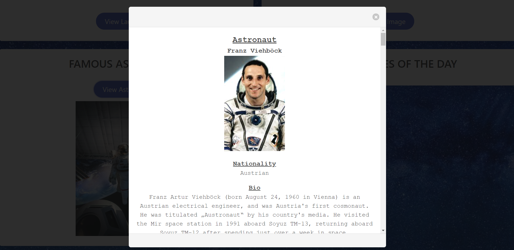

## This site is fully responsive for all screen sizes.

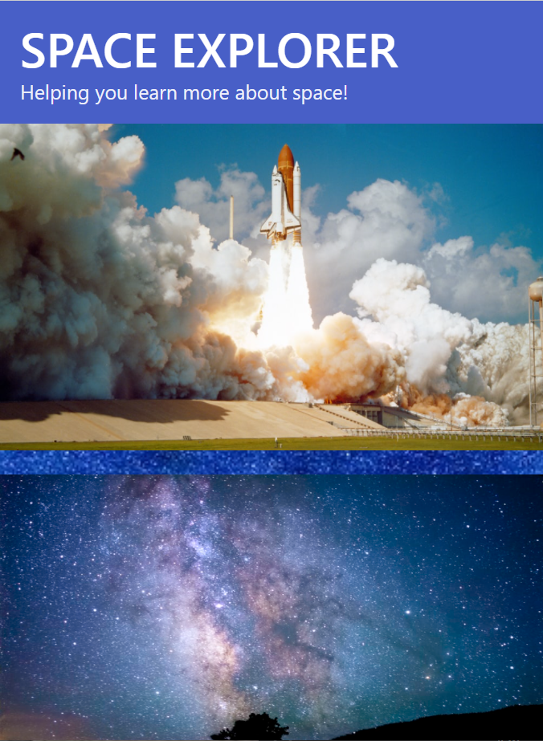
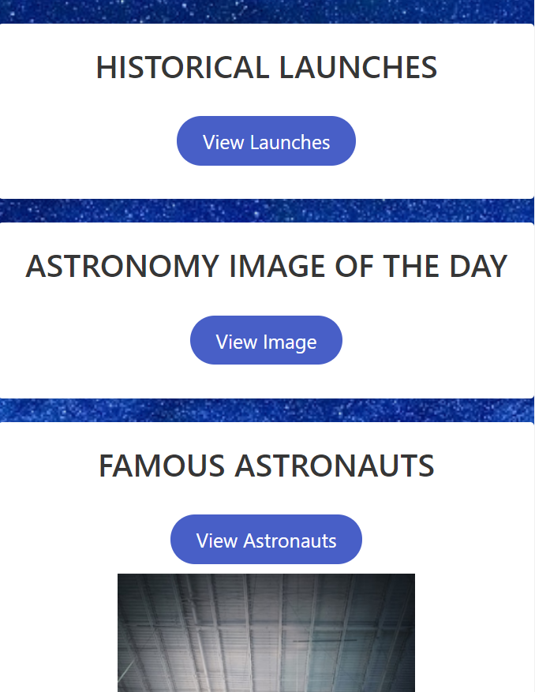

## Click here to view Space Explorer now: https://jamwil1226.github.io/space-explorer/

## We hope you enjoy becoming a Space Explorer! We welcome all contributions and feedback!

## We look forward to hearing from you!

### _Brittney Baker_

### _Christian Beam_

### _Jamie Williams_

### _Tyler Torres_

### _Vanessa Sylverain_

